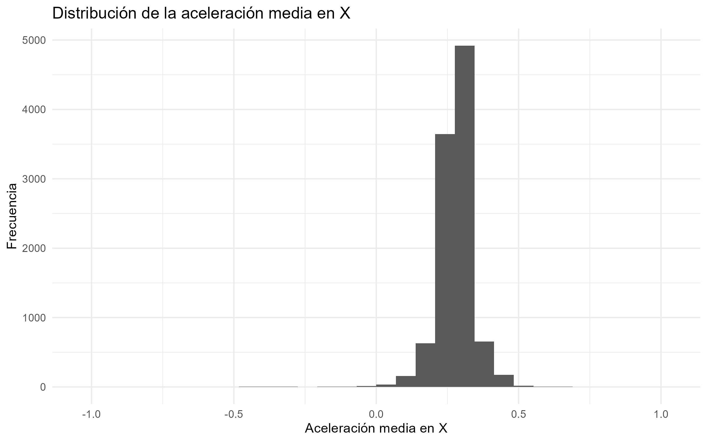
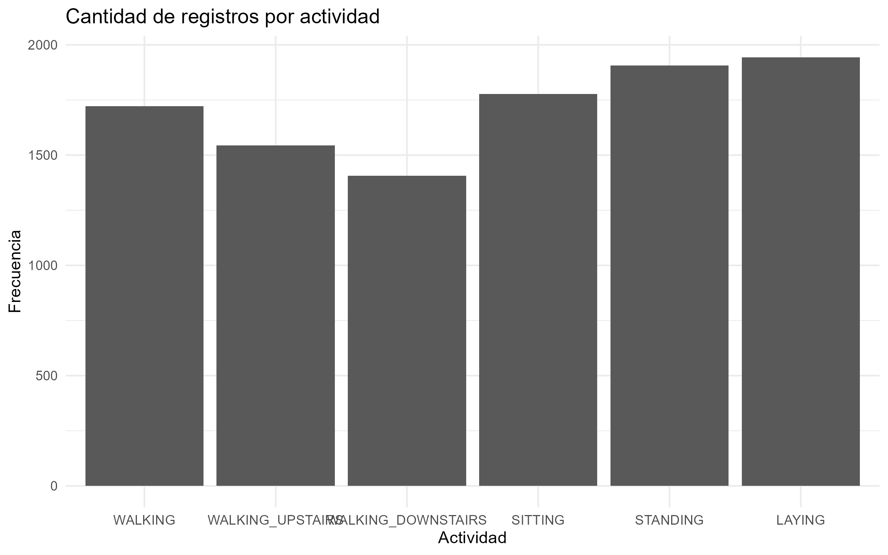
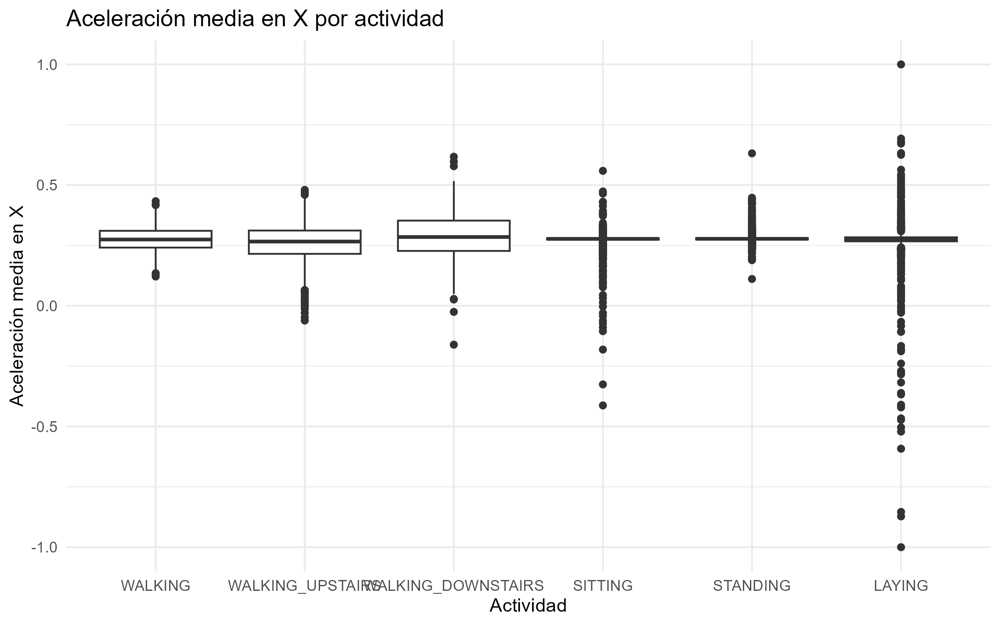
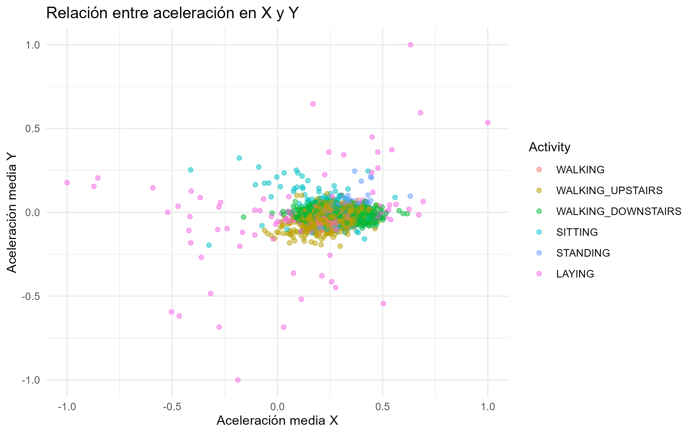

# Análisis descriptivo de datos inerciales con R

Proyecto desarrollado para la materia **Probabilidad y Estadística Inferencial**.

Este repositorio presenta un análisis descriptivo de datos obtenidos mediante sensores inerciales, específicamente acelerómetro y giroscopio. El objetivo es estudiar el comportamiento estadístico de señales similares a las que se utilizan en robótica móvil, sistemas embebidos y reconocimiento de movimiento.

---

## Dataset utilizado

Se utilizó el dataset **Human Activity Recognition Using Smartphones**, disponible en el repositorio UCI Machine Learning Repository.

Los datos fueron recolectados usando sensores de un teléfono inteligente mientras diferentes sujetos realizaban actividades como:

- Walking
- Walking upstairs
- Walking downstairs
- Sitting
- Standing
- Laying

Fuente del dataset:  
https://archive.ics.uci.edu/dataset/240/human+activity+recognition+using+smartphones

---

## Objetivo del proyecto

Realizar un análisis descriptivo de señales inerciales con el fin de identificar patrones estadísticos asociados a diferentes tipos de movimiento.

---

## Herramientas utilizadas

- R
- tidyverse
- ggplot2
- VS Code
- Git y GitHub

---

## Variables seleccionadas

| Variable | Descripción |
|---|---|
| `Activity` | Actividad realizada |
| `Acc_Media_X` | Aceleración media en el eje X |
| `Acc_Media_Y` | Aceleración media en el eje Y |
| `Acc_Media_Z` | Aceleración media en el eje Z |
| `Acc_Desv_X` | Desviación estándar de aceleración en X |
| `Acc_Desv_Y` | Desviación estándar de aceleración en Y |
| `Acc_Desv_Z` | Desviación estándar de aceleración en Z |
| `Gyro_Media_X` | Velocidad angular media en X |
| `Gyro_Media_Y` | Velocidad angular media en Y |
| `Gyro_Media_Z` | Velocidad angular media en Z |

---

## Análisis realizado

En el proyecto se realizaron los siguientes procedimientos:

1. Carga de datos de entrenamiento y prueba.
2. Unión de tablas de datos, sujetos y actividades.
3. Asignación de nombres correctos a las variables.
4. Selección de variables relevantes.
5. Cálculo de medidas estadísticas descriptivas.
6. Generación de tablas de frecuencia.
7. Visualización mediante histogramas, diagramas de caja y gráficos de dispersión.
8. Exportación de tablas y figuras para el informe final.

---

## Resultados principales
Pega esta sección después de “Resultados principales” y antes de “Archivos generados”:

---

## Generación de imágenes

Las imágenes usadas en este repositorio no se generan automáticamente al ejecutar el código base. Para generarlas, primero se debe ejecutar el script principal `proyecto.R` hasta crear el objeto `datos_seleccionados`. Luego, se pueden ejecutar los siguientes comandos en la consola de R.

### Histograma de aceleración media en X

```r
ggplot(datos_seleccionados, aes(x = Acc_Media_X)) +
  geom_histogram(bins = 30) +
  labs(
    title = "Distribución de la aceleración media en X",
    x = "Aceleración media en X",
    y = "Frecuencia"
  ) +
  theme_minimal()

ggsave("Figures/histograma_acc_x.png", width = 8, height = 5)
```

### Boxplot por actividad

```r
ggplot(datos_seleccionados, aes(x = Activity, y = Acc_Media_X)) +
  geom_boxplot() +
  labs(
    title = "Aceleración media en X por actividad",
    x = "Actividad",
    y = "Aceleración media en X"
  ) +
  theme_minimal()

ggsave("Figures/boxplot_acc_x.png", width = 8, height = 5)
```

### Scatter plot

```r
ggplot(datos_seleccionados,
       aes(x = Acc_Media_X,
           y = Acc_Media_Y,
           color = Activity)) +
  geom_point(alpha = 0.5) +
  labs(
    title = "Relación entre aceleración en X y Y",
    x = "Aceleración media X",
    y = "Aceleración media Y"
  ) +
  theme_minimal()

ggsave("Figures/scatter_acc_xy.png", width = 8, height = 5)
```

### Barras de actividades

```r
ggplot(datos_seleccionados, aes(x = Activity)) +
  geom_bar() +
  labs(
    title = "Cantidad de registros por actividad",
    x = "Actividad",
    y = "Frecuencia"
  ) +
  theme_minimal()

ggsave("Figures/frecuencia_actividades.png", width = 8, height = 5)
```

### Distribución de la aceleración media en X



La mayoría de los datos se concentran alrededor de valores centrales de aceleración, aunque existen algunos valores alejados asociados posiblemente a movimientos más dinámicos.

---

### Cantidad de registros por actividad



La base de datos presenta una distribución relativamente balanceada entre las diferentes actividades analizadas.

---

### Aceleración media en X por actividad



El diagrama de caja permite observar diferencias en la dispersión y presencia de valores atípicos según la actividad realizada.

---

### Relación entre aceleración media en X y Y



El gráfico de dispersión muestra agrupaciones parcialmente diferenciables entre actividades, lo que indica que las señales de aceleración contienen información útil para distinguir patrones de movimiento.

---

## Archivos generados

| Archivo | Descripción |
|---|---|
| `proyecto.R` | Código principal del análisis en R |
| `datos_seleccionados_robotica.csv` | Base de datos limpia con variables seleccionadas |
| `tabla_actividades.csv` | Tabla de frecuencia de actividades |
| `resumen_por_actividad.csv` | Estadísticos descriptivos agrupados por actividad |
| `primeras_20_filas.csv` | Extracto de datos para anexos |
| `*.png` | Figuras generadas para el informe |

---

## Conclusiones

El análisis permitió evidenciar que las señales inerciales presentan comportamientos estadísticos distintos dependiendo de la actividad registrada.

Las actividades dinámicas muestran mayor variabilidad en comparación con actividades estáticas, lo cual se observa principalmente en los diagramas de caja y gráficos de dispersión.

Este proyecto muestra cómo la estadística descriptiva puede aplicarse al análisis de datos provenientes de sensores utilizados en robótica, sistemas embebidos y reconocimiento de movimiento.

---

## Autor

Proyecto realizado por:

Jose Esteban Robayo Herrera 
Pontificia Universidad Javeriana  
Probabilidad y Estadística Inferencial
